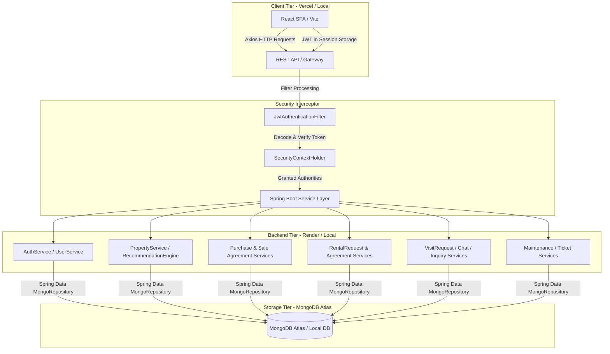

# Real Estate Hub

A enterprise-grade, full-stack real estate marketplace and property maintenance platform. The system is designed to bridge the gap between property discovery, lease/sale transaction flows, and post-occupancy operational maintenance. 

Real Estate Hub provides custom, role-based dashboards for **Buyers/Tenants**, **Landlords/Property Owners**, **Maintenance Staff**, and **System Administrators**. It features secure JWT authentication, document-based transaction approvals for sales and rentals, site visit scheduling, live chat with typing heartbeats, and an automated skill-matching engine for dispatching maintenance tickets.

---

## Features

### Authentication & Security
* **Stateless JWT Sessions**: Secures client requests using short-lived tokens stored in client-side session storage.
* **Role-Based Access Control (RBAC)**: Distinguishes system privileges between `ROLE_USER`, `ROLE_MAINTENANCE`, and `ROLE_ADMIN`.
* **Cryptographic Protections**: Encrypts user credentials in the database using the BCrypt hashing algorithm.
* **Route Guards**: Custom frontend router intercepts unauthorized access attempts and handles dynamic landing redirects.
* **CORS Configurations**: Restricts API calls to approved origins (such as Localhost and production environments).

### Property Marketplace
* **Geospatial Discovery**: Leverages MongoDB 2D sphere indexing for location-based distance queries and coordinates registration.
* **Rich Search & Filters**: Allows buyers/tenants to narrow search results by city, purpose (sale/rent), pricing thresholds, specs, and amenities.
* **Curated Recommendations**: Displays recommended properties sorting by promoted/featured flags and listing age.
* **Property Detail Visualizations**: Comprehensive listings complete with image galleries, furnishing status, dimensions, and specifications.

### Property Management
* **Listing Lifecycle**: Real-time status state-machine modeling (`AVAILABLE`, `PENDING`, `APPROVED`, `FLAGGED`, `REJECTED`, `SOLD`, `RENTED`, `SALE_IN_PROGRESS`, `RENT_IN_PROGRESS`).
* **Specifications Tracking**: Records bed/bath counts, parking spaces, furnishing status, ownership type, and availability dates.
* **Administrative Moderation**: Admin queue to approve, reject, flag, or feature property listings.

### Communication System
* **Contextual Live Chat**: Implements property-specific inbox threads directly linking prospective buyers/tenants and landlords.
* **Read-Receipts & Badges**: Tracks conversation read status to prompt user notifications.
* **Typing Feedback Heartbeats**: Sends typing alerts based on a 3-second polling state.
* **Conversation Cleanup**: Offers complete thread deletion and message pruning capabilities.

### Maintenance Management
* **Guest Submission Support**: Unregistered tenants can submit issues by entering their unique `tenantCode` linked to an active lease.
* **Granular Priority & Types**: Categorizes tasks (e.g., Plumbing, Electrical, HVAC) with severity alerts (`LOW`, `MEDIUM`, `HIGH`, `EMERGENCY`).
* **Skills-Based Dispatching**: Automatic category matching routes tickets to staff members listing matching technical skills.
* **Resolution Checklists**: Staff uploads before/after photos and reports final resolution summaries upon ticket closure.

### User Experience
* **Premium Dark Mode**: Built with custom styling palettes, dark styling, and glassmorphic panels.
* **Interactive Timelines**: Visually traces ticket status and history.
* **Form Verification**: Frontend input verification safeguards data integrity before sending requests.

### Deployment
* **Vercel Routing**: Supports React Router SPA client navigation via custom redirect files.
* **Multi-Stage Dockerfile**: Multi-stage JRE 17 Docker deployment templates minimize final production image sizes.

---

## System Workflows

### Property Listing Workflow
```
[ Landlord / Seller ]
         │
         ├─► Submits details, geolocation, specs, and media attachments
         ▼
[ Property (PENDING Status) ]
         │
         ├─► Admin reviews from verification panel
         ▼
[ Admin Decision ]
   ├── Approve ──► Set Status: AVAILABLE (Visible in public marketplace)
   └── Reject  ──► Set Status: REJECTED (Hidden from search)
```

### Purchase Request Workflow
```
[ Buyer ] ──► Submits Purchase Request ──► [ Property: PENDING_BUYER_CONFIRMATION ]
                                                    │
[ Owner ] ◄── Accepts Request ──────────────────────┘
   │
   ▼
Status: SALE_IN_PROGRESS
   │
   ├─► Owner uploads signed Sale Agreement document (binary byte[] storage)
   ▼
[ Buyer ] ──► Downloads, reviews, and approves Sale Agreement
   │
   ▼
Status: SOLD (Transaction closed, property locked from further actions)
```

### Rental Workflow
```
[ Tenant ] ──► Submits Rent Application ──► [ Property: PENDING_TENANT_CONFIRMATION ]
                                                    │
[ Owner ] ◄── Accepts Application ──────────────────┘
   │
   ▼
Status: RENT_IN_PROGRESS
   │
   ├─► Owner uploads lease terms & document PDF
   ▼
[ Tenant ] ──► Reviews rules, accepts terms & simulates deposit payment
   │
   ▼
Status: RENTED (Active tenancy mapped; unique Tenant Verification Code generated)
```

### Site Visit Scheduling Workflow
```
[ Buyer ] ──► Submits target ISO Date & Time request for a property
   │
   ▼
[ Visit Status: PENDING ]
   │
   ├─► Notifies owner on Dashboard queue
   ▼
[ Owner ] ──► Accepts / Rejects schedule ──► [ Status: ACCEPTED / REJECTED ]
```

### Maintenance Ticket Workflow
```
[ Tenant ] ──► Raises issue (Contextual property select or Guest Tenant Code verification)
   │
   ▼
[ Matching Engine ] ──► Filters active staff profiles by categories (Plumbing, Electrical, etc.)
   │
   ▼
[ Staff Dashboard ] ──► Staff claims ticket (Status transitions from OPEN to ACCEPTED)
   │
   ▼
[ Work In Progress ] ──► Staff initiates repair (Status updates to IN_PROGRESS)
   │
   ▼
[ Completion ] ──► Staff uploads before/after photos and inputs resolution log
   │
   ▼
[ Status: RESOLVED ] (SLA deadlines updated and metrics logged)
```

### Messaging Workflow
```
[ User ] ──► Clicks 'Send Message' on Property detail page
   │
   ▼
[ Conversation Thread ] ──► Groups message history by property ID and participant IDs
   │
   ├─► Client poll heartbeats track active typing status
   ├─► Read status flips flag upon loading thread view
   ▼
[ Inbox Response ] ──► Displays chronological list of latest chats with unread alert badges
```

---

## Tech Stack

### Frontend
* **Core Framework**: React (Single Page Application structure)
* **Build System**: Vite
* **Styling**: Tailwind CSS, Vanilla CSS
* **HTTP Client**: Axios (configured with request interceptors for automated JWT injection)
* **Navigation**: React Router DOM (with route authentication checking)
* **JSON Web Tokens**: JWT Decode (decodes token details client-side)

### Backend
* **Core Engine**: Spring Boot
* **Security Framework**: Spring Security
* **Security Configuration**: Method-level security permissions via `@EnableMethodSecurity` and `@PreAuthorize`
* **JSON Web Tokens**: HMAC-SHA256 signing and verification
* **Data Storage**: Spring Data MongoDB (Object-document mapping, MongoTemplate)
* **Development Utility**: Lombok

### Database & Deployment
* **Database Engine**: MongoDB Atlas (NoSQL cloud database storage)
* **Indexing**: Geospatial index (`2dsphere`) & Compound indexes (e.g. `city_purpose_price_idx`)
* **Backend Deployment**: Render (Runtime Web Services)
* **Frontend Deployment**: Vercel (rewriting SPA routes)
* **Containerization**: JRE 17 Multi-stage Docker deployment template

---

## Architecture



---

## Screenshots

### Landing Page
         

### User Dashboard
         

### Marketplace
         

### Property Details
         

### Chat System
         

### Mobile Experience
         /9j/4AAQSkZJRgABAQAAAQABAAD/2wCEABsbGxscGx4hIR4qLSgtKj04MzM4PV1CR0JHQl2NWGdYWGdYjX2Xe3N7l33gsJycsOD/2c7Z//////////////8BGxsbGxwbHiEhHiotKC0qPTgzMzg9XUJHQkdCXY1YZ1hYZ1iNfZd7c3uXfeCwnJyw4P/Zztn////////////////CABEIAEgAHwMBIgACEQEDEQH/xAAuAAEAAwEBAAAAAAAAAAAAAAAAAQIDBQQBAQEBAQAAAAAAAAAAAAAAAAABAwT/2gAMAwEAAhADEAAAAOHalE2pnJElqJFqzAB6rdTXmnDp2Mdr7xQV/8QAJhAAAQQABAUFAAAAAAAAAAAAAQACAxEEECExBRMVM1EUIEJhcf/aAAgBAQABPwBtEUSAhHGd5AE2maghOdpWia9rfjaB3yvSstPfTnD8yJJyF+FR3pUatEEbhNw85YCwWCvS4igKTsPMxwbSkjmAt4NBQSsETR9LnM8p0jRMw2sU4mF4XQpQO8jwSQDurokm/NR4FIQblX//xAAcEQABAwUAAAAAAAAAAAAAAAABAAIREBITICH/2gAIAQIBAT8A2z9i0pr5AUCn/8QAGREAAQUAAAAAAAAAAAAAAAAAAAEQESAh/9oACAEDAQE/ALSar//Z

---

## Installation

### Frontend Setup
1. Navigate to the frontend directory:
   ```bash
   cd frontend
   ```
2. Install dependencies:
   ```bash
   npm install
   ```
3. Run the development server:
   ```bash
   npm run dev
   ```
   The client will start running locally at: `http://localhost:5173`.

### Backend Setup
1. Navigate to the backend directory:
   ```bash
   cd realestate
   ```
2. Build and package the Spring Boot application using Maven:
   ```bash
   mvn clean install
   ```
3. Run the Spring Boot application:
   ```bash
   mvn spring-boot:run
   ```
   The backend API will start running locally at: `http://localhost:8080`.

### Environment Variables
Configure these variables to connect components:

#### Backend Settings (`realestate/src/main/resources/application.properties`)
* `PORT`: Server port (defaults to `8080`)
* `MONGODB_URI`: MongoDB connection string (e.g. `mongodb+srv://<user>:<password>@cluster.mongodb.net/realestate`)
* `JWT_SECRET`: Signing key for JWT validation
* `ALLOWED_ORIGINS`: Permitted origins (e.g. `http://localhost:5173`)

#### Frontend Settings (`frontend/.env`)
* `VITE_API_BASE_URL`: Base address of the API backend (`http://localhost:8080`)
* `VITE_API_URL`: Path suffix for requests (`http://localhost:8080/api`)

---

## API Overview

| Category | Endpoint | Method | Description | Access |
|---|---|---|---|---|
| **Auth** | `/api/auth/login` | `POST` | Authenticate credentials and return JWT token | Public |
| | `/api/auth/register` | `POST` | Register a new user | Public |
| **Properties** | `/api/properties` | `GET` | Retrieve and search active property listings | Public |
| | `/api/properties/{id}` | `GET` | Fetch specific property details | Public |
| | `/api/properties` | `POST` | Create a new property listing | Authenticated |
| **Purchases** | `/api/purchase-requests` | `POST` | Request purchase of a property | Authenticated |
| | `/api/purchase-requests/owner` | `GET` | View purchase requests received by owner | Authenticated |
| | `/api/purchase-requests/{id}/accept`| `PUT` | Accept buyer purchase request | Authenticated |
| **Sales** | `/api/sale-agreements/upload`| `POST` | Upload property sale agreement file | Authenticated |
| | `/api/sale-agreements/{id}/review` | `POST` | Approve/reject uploaded agreement terms | Authenticated |
| **Rentals** | `/api/rental-requests` | `POST` | Request rental application | Authenticated |
| | `/api/rentals/upload` | `POST` | Upload lease terms and file attachment | Authenticated |
| | `/api/rentals/{propertyId}/accept` | `PUT` | Accept terms of a lease agreement | Authenticated |
| | `/api/rentals/{propertyId}/simulate-payment` | `PUT` | Simulate security deposit payment | Authenticated |
| **Visits** | `/api/visits` | `POST` | Schedule site inspection visit date | Authenticated |
| | `/api/visits/{id}/status` | `PUT` | Update visit booking status | Authenticated |
| **Chat** | `/api/chat` | `POST` | Send chat message to user | Authenticated |
| | `/api/chat/{propertyId}/{userId}` | `GET` | Fetch chat history for thread | Authenticated |
| | `/api/chat/inbox` | `GET` | List user chat conversations list | Authenticated |
| | `/api/chat/typing` | `POST` | Update user typing status | Authenticated |
| **Maintenance** | `/api/maintenance` | `POST` | Create a new maintenance request | Authenticated |
| | `/api/maintenance/available` | `GET` | List open tickets matching staff skills | Staff Only |
| | `/api/maintenance/{id}/accept` | `PUT` | Claim and assign ticket to staff | Staff Only |
| | `/api/maintenance/{id}/complete` | `PUT` | Upload photos and log resolution details | Staff Only |
| | `/api/guest/maintenance` | `POST` | File maintenance ticket using `tenantCode` | Public |
| **Admin** | `/api/admin/stats` | `GET` | Access system-wide analytical metrics | Admin Only |
| | `/api/admin/users/{id}/ban` | `PUT` | Ban user for suspicious/fraudulent activity | Admin Only |
| | `/api/admin/properties/{id}/approve`| `PUT` | Approve property listing queue | Admin Only |

---

## Security

### JWT Authentication
The system operates a stateless security layer. Upon login:
1. Credentials are verified by `AuthenticationManager`.
2. A JWT token is signed on the server containing user sub, roles, and issue times.
3. The token is sent to the client, which stores it in session storage and injects it into subsequent HTTP requests under the header `Authorization: Bearer <token>`.
4. The backend `JwtAuthenticationFilter` intercepts requests, extracts the token, verifies the signature, and populates the `SecurityContextHolder`.

### Password Hashing
User passwords are encrypted with `BCryptPasswordEncoder` before storage. This ensures security against data breaches by generating unique salts for each hashed value.

### Role Based Access Control (RBAC)
Method-level security is enforced at the controller entry point. Directives like `@PreAuthorize("hasRole('ADMIN')")` or `@PreAuthorize("hasRole('MAINTENANCE')")` prevent cross-role data leaks.

### Protected Routes
Client-side routers dynamically block pages based on role parameters, immediately redirecting unauthenticated traffic to `/login` and redirecting users to dashboards custom-tailored to their authorization level.

---

## Deployment

The system uses a cloud deployment architecture:

```
[ Frontend Client (Vercel) ] ◄──► [ REST API Backend (Render) ] ◄──► [ Managed DB (MongoDB Atlas) ]
```

* **Vercel**: Hosts the static compiled assets of the React application. Uses rewriting rules in `vercel.json` to handle client-side route redirects.
* **Render**: Hosts the backend service. Reads custom environment variables from the server runtime dashboard and exposes port `8080` via TLS.
* **MongoDB Atlas**: Serves as the database. Enforces IP whitelist configurations and houses all database collections.

---

## Future Enhancements
* **Container Orchestration**: Add Docker Compose configurations to spin up development environments (backend, frontend, local Mongo instance) in a single command.
* **Automated CI/CD Pipelines**: Implement GitHub Actions configurations to run unit tests and automatically deploy changes to Vercel and Render.
* **Automated Notification Triggers**: Add support for email and SMS alerts for status changes (e.g. site visit approvals, payment alerts).

---

## Author

 ||**Siva Prasad M L** |
|**Ritharaj**||
